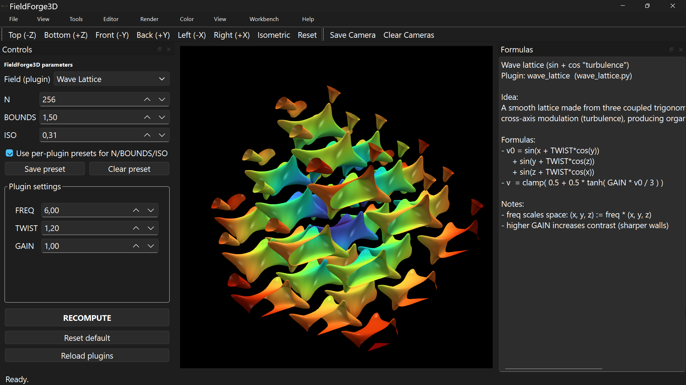

# FieldForge3D

**Interactive 3D implicit field visualizer (Python + PyVista + PyQt)**
<p align="center">
  
</p>
FieldForge3D lets you explore mathematical 3D scalar fields and generate smooth implicit surfaces in real time.
Small parameter changes produce rich geometric structures – ideal for experimentation, visualization, and even 3D printing.

---

# ✨ Features

* Real-time implicit surface rendering
* Plugin-based architecture (easy to extend)
* Smooth shell fields and nonlinear mappings
* Parameter exploration (FREQ, TWIST, GAIN…)
* Built with PyVista + PyQt6
* Cross-platform (Windows / Linux)

---

# 📦 Installation

## 🪟 Windows

```bash
git clone https://github.com/finky666/FieldForge3D.git
cd FieldForge3D/FieldForge3D

python -m venv .venv
.venv\Scripts\activate

pip install -r requirements.txt

python main.py
```

---

## 🐧 Linux (Ubuntu 22.04 / 24.04)

### 1) Clone project

```bash
git clone https://github.com/finky666/FieldForge3D.git
cd FieldForge3D/FieldForge3D
```

---

### 2) Create virtual environment (REQUIRED)

```bash
python3 -m venv .venv
source .venv/bin/activate
```

---

### 3) Install dependencies

```bash
pip install -r requirements.txt
```

---

### ⚠️ Important (Ubuntu 24.04 / Python 3.12)

Modern Ubuntu uses **externally managed Python (PEP 668)**.

This means:

❌ `pip install` system-wide will fail
✅ You MUST use a virtual environment (`venv`)

---

# 🧩 Linux Fixes (Qt / PyVista)

If the application crashes with errors like:

```
Could not load the Qt platform plugin "xcb"
BadWindow (invalid Window parameter)
```

install required libraries:

```bash
sudo apt install libxcb-cursor0 libxcb-xinerama0 libxkbcommon-x11-0 -y
```

---

### Wayland issue workaround

Force Qt to use X11:

```bash
export QT_QPA_PLATFORM=xcb
```

---

# ▶️ Run

## Windows

```bash
python main.py
```

## Linux

```bash
source .venv/bin/activate
QT_QPA_PLATFORM=xcb python3 main.py
```

---

# 🧠 Concept

FieldForge3D works with scalar fields:

```
f(x, y, z) → ℝ
```

and extracts iso-surfaces.

Example transformation:

* Start with ellipsoid:

  ```
  E(x,y,z) = (x/a)^2 + (y/b)^2 + (z/c)^2 - 1
  ```

* Apply deformation:

  ```
  x' = x / (1 + k·z)
  y' = y / (1 + k·z)
  ```

* Convert to smooth shell:

  ```
  S(x,y,z) = exp(-g · |E'(x,y,z)| / t)
  ```

Small parameter changes → large geometric differences.

---

# 🔌 Plugins

Each field is implemented as a plugin.

Examples:

* wave_lattice
* gyroid
* metaballs
* mandelbulb (planned / extended)

Plugins define:

* parameters
* compute() function
* optional UI

---

# 🧪 Typical workflow

1. Select plugin
2. Adjust parameters
3. Click **RECOMPUTE**
4. Explore geometry
5. Export / screenshot / animate

---

# 🎥 Tips

* Use lower `N` for fast preview
* Increase `N` for high-quality surfaces
* Adjust `GAIN` for sharper structures
* Combine multiple fields for complex shapes

---

# 🧊 3D Printing (optional)

You can export geometry (future extension):

* STL export (recommended)
* Use in Blender / slicer software
* Ideal for mathematical sculptures

---

# 🧰 Requirements

* Python 3.10+
* PyQt6
* PyVista
* NumPy
* Numba

---

# 🖥 Tested on

* Windows 10 / 11
* Ubuntu 24.04 (Python 3.12)

---

# ⚠️ Known Issues

* Wayland may cause crashes → use `QT_QPA_PLATFORM=xcb`
* Missing Qt libraries on fresh Ubuntu installs
* High `N` values can consume a lot of RAM

---

# ❤️ Why this project exists

This started as an experiment.

Then it became a tool.

Then it became a playground for mathematical imagination.

---

# 🚀 Future ideas

* STL export
* animation recording
* plugin marketplace
* performance auto-scaling
* GPU acceleration

---

# 👤 Author

Tibor Čefan
(with heavy assistance from AI 😄)

---

# 📜 License

MIT License
